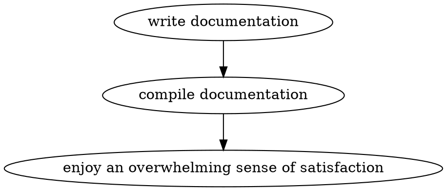

---
title: Judo Markdown
author: Daniel Jones
...

Markdown interpreted by Judo is
[pandoc markdown](http://johnmacfarlane.net/pandoc/README.html#pandocs-markdown)
with some extensions.

# YAML Front-Matter

Markdown is great, but its often useful to be able to attach metadata to a
document. Judo borrows an idea from [Jekyll](http://jekyllrb.com/) to overcome
this. Before parsing a markdown document, Judo will look for a
leading [YAML](http://yaml.org/) document.

Front-matter documents can be delineated with with `---`, indicating the
beginning of a YAML document, and `...`, indicating the end. This is standard
YAML, so document metadata can be parsed with any YAML parser.

There is no restrictions on what is included in the metadata, but a few fields
are used directly by Judo.


## Metadata Fields

`author`, `authors`: gives the name of the document's author or authors.

`title`: gives the title of the document, which is used when generating a table
of contents.

`data`: the date when the document was last modified.

TODO: In the future more fields will be added, in particular `topics` to ease
the generation of an index.


# Executable Code Blocks

Regular markdown code blocks are by default interpreted as Julia code and
executed.

For example this code block will display its output inline in the compiled
version of this document.

```julia
println("Hello world!")
```

## Controlling Execution

Pandoc markdown allows attaching
[attributes](http://johnmacfarlane.net/pandoc/README.html#header-identifiers-in-html-latex-and-context)
to code blocks. These are used in Judo to control how code blocks are handled.

The following key/value pairs are supported.

  * `execute="false"`: Do not execute the code block.
  * `hide="true"`: Do not display the code block itself.
  * `display="false"`: Do not display the output from executing the code block.
  * `results="block"`: Display the result of the last expression in the block.
  * `results="expression"`: Display the result of every expression in the block.

Note: pandoc is pretty picky about how these are parsed. For example, quotation
marks around the value in key/value pairs are mandatory.


## Non-Julia Executables

Not just Julia code can be executed. Code blocks can also be used to include
output from latex, graphiviz, or directly include svg code. Others can be added
easily.





